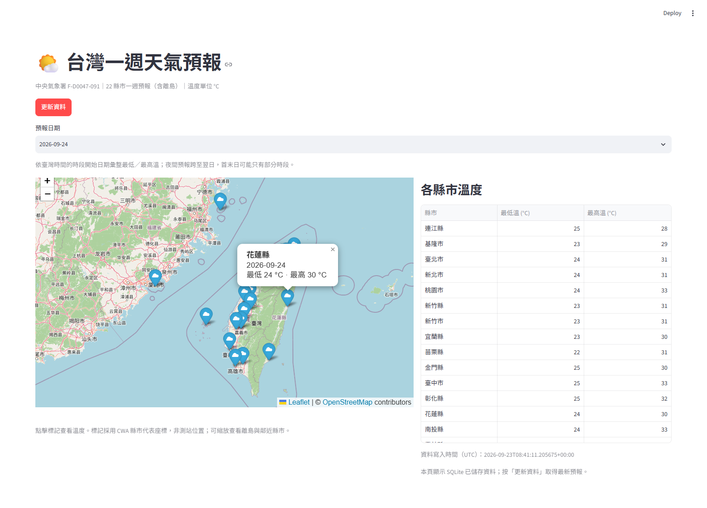

# HW1-CWA-Weather-Forecast-AI-Agent

使用 Python、中央氣象署 CWA API、SQLite 與 Streamlit，展示臺灣 **22 縣市（含離島）一週天氣預報**。支援日期選擇、folium 互動地圖、最低／最高溫表格與一鍵更新。

## 資料來源

採用 `F-D0047-091`「臺灣未來 1 週天氣預報」，端點為：

```text
https://opendata.cwa.gov.tw/api/v1/rest/datastore/F-D0047-091
```

參數為 `Authorization`（從本機環境取得）與 `format=JSON`。[官方 API 文件](https://opendata.cwa.gov.tw/dist/opendata-swagger.html)。

原規劃的 `F-A0010-001` 一週農業氣象預報已下架，官方於 2026-06-03 發布 7/1 下架通知（[公告列表](https://opendata.cwa.gov.tw/announcement/news?page=1)）。本專案因此改採現行一週預報，並改為縣市展示；沒有將縣市資料冒充原六地區農業預報。

## 安裝與設定

需要 Python 3.12。在 PowerShell 中：

```powershell
cd HW1-CWA-Weather-Forecast-AI-Agent
python -m venv .venv
.\.venv\Scripts\python.exe -m pip install -r requirements.txt
```

若尚無 `.env`，複製 `.env.example` 為 `.env`，填入向 [中央氣象署](https://opendata.cwa.gov.tw/) 申請的授權碼：

```dotenv
CWA_API_KEY=你的中央氣象署授權碼
```

透過 `python-dotenv` 讀取專案根目錄 `.env`，已設定的環境變數優先；每次更新重新讀取設定。`.env` 不會提交到 Git，不要將 Key 放入程式或截圖。

macOS / Linux 使用 `python3 -m venv .venv`，後續將 `.venv\Scripts\python.exe` 改為 `.venv/bin/python`。

## 啟動與展示

```powershell
.\.venv\Scripts\python.exe -m streamlit run app.py
```

開啟 <http://localhost:8501>：

1. 按「更新資料」，從 CWA 下載、解析並存入 SQLite。
2. 選擇預報日期，右側表格顯示 22 縣市的最低／最高溫；表格可捲動。
3. 點擊地圖標記查看縣市、日期與溫度，可縮放查看鄰近縣市與離島。
4. 再次更新，同縣市同日期會 upsert，不會新增重複資料。

首次啟動不自動呼叫 API；沒有資料時會提示更新。API 或解析失敗時保留原資料庫，仍可查看已儲存預報。資料庫的歷史日期會保留，選到過去日期會顯示提醒。

### 日期與溫度的意義

CWA 原始資料按時段提供最低／最高溫。本專案先以 `StartTime`、`EndTime` 配對兩種溫度，再轉為臺灣時間 UTC+8，以**時段開始日期**分組，取該組最低溫的最小值與最高溫的最大值。

例如 9/24 06:00–18:00 與 9/24 18:00–9/25 06:00 都歸在 9/24。這是預報時段彙整值，不是 00:00–24:00 精確曆日極值；首末日也可能僅包含部分時段。介面已標註此規則，沒有對跨午夜時段自行內插。

地圖採用下載資料提供的縣市代表座標，保存在 `src/locations.py`，不是測站位置。OpenStreetMap 底圖及前端地圖資源需要網路。`updated_at` 是本機寫入時間（UTC），不是 CWA 發布時間。

## 原始 JSON 與解析

```powershell
.\.venv\Scripts\python.exe -m src.fetch
```

此命令下載並儲存 `data/raw.json`，列印 JSON 所有不同的葉節點路徑；不會寫入資料庫。失敗時回傳非零結束碼，不顯示包含 Key 的請求 URL。

已透過真實 JSON 確認的主要路徑：

```text
$.records.Locations[].Location[].LocationName
$.records.Locations[].Location[].Latitude
$.records.Locations[].Location[].Longitude
$.records.Locations[].Location[].WeatherElement[].ElementName
$.records.Locations[].Location[].WeatherElement[].Time[].StartTime
$.records.Locations[].Location[].WeatherElement[].Time[].EndTime
$.records.Locations[].Location[].WeatherElement[].Time[].ElementValue[].MinTemperature
$.records.Locations[].Location[].WeatherElement[].Time[].ElementValue[].MaxTemperature
```

解析器選取 `ElementName` 為「最低溫度」與「最高溫度」的資料。遇到缺漏縣市、不匹配或重複時段、缺值、非法溫度、最低溫大於最高溫時，拒絕整批寫入。

SQLite 位於 `data/weather.db`，資料表為 `forecast(region, date, min_temp, max_temp, updated_at)`，其中 `region` 現在存放縣市名稱。主鍵 `(region, date)` 保證不重複，批次 upsert 使用同一交易。

## 測試

```powershell
.\.venv\Scripts\python.exe -m pytest -q
.\.venv\Scripts\python.exe -m pip check
```

33 個測試涵蓋抓取錯誤、金鑰遮蔽、跨日與時區處理、溫度時段配對、22 縣市完整性、SQLite upsert／交易回復，以及 Streamlit 更新、日期切換、無 Key、無資料及失敗後保留資料。單元測試使用合成資料與暫存資料庫，不呼叫真實 API。

另提供真實瀏覽器驗證（需已安裝 Google Chrome、設定 Key，並先啟動本機 App）：

```powershell
.\.venv\Scripts\python.exe -m pip install -r requirements-dev.txt
.\.venv\Scripts\python.exe scripts/browser_smoke.py
```

此測試會實際更新本機天氣資料庫、切換日期、點擊地圖 popup，並儲存 `docs/screenshots/forecast.png`。

2026-09-23 真實 API 整合結果：HTTP 200，22 縣市、7 個開始日期（9/23–9/29），共 154 筆；連續 upsert 後仍為 154 筆。日期與筆數會隨 CWA 最新預報變動。

本機 Chrome 已驗證更新按鈕、日期切換、22 個地圖標記及溫度 popup；Streamlit 健康檢查回傳 HTTP 200。

## 成果截圖



截圖路徑：`docs/screenshots/forecast.png`。這是本機真實預報介面的截圖，並非即時更新圖片。

## 專案結構

```text
app.py                 # Streamlit 地圖與表格
src/fetch.py           # API 下載、原始 JSON 與欄位路徑
src/parse.py           # 縣市時段解析與每日彙整
src/db.py              # SQLite 建表、upsert、查詢
src/locations.py       # CWA 縣市代表座標
tests/                 # pytest / Streamlit AppTest
scripts/browser_smoke.py
data/                  # raw.json、weather.db（不提交）
docs/screenshots/      # 展示截圖
.env.example           # 無金鑰設定範本
requirements.txt       # App 與單元測試套件
requirements-dev.txt   # 額外瀏覽器驗證工具
```

## Git

遠端：<https://github.com/benson103081/HW1-CWA-Weather-Forecast-AI-Agent.git>，主分支 `main`。

推送前確認：

```powershell
git ls-files -- .env
git check-ignore .env .venv data/raw.json data/weather.db
```

第一個命令應無輸出。`.gitignore` 排除 `.venv`、`.env`、Python 快取、SQLite 資料庫、原始 JSON 與日誌。
